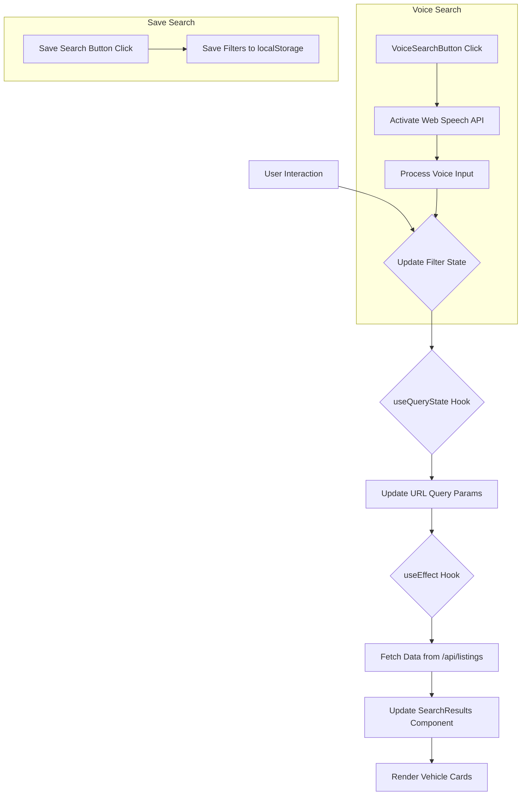

# Advanced Vehicle Search Component: Architectural Plan

## 1. Component Breakdown

The "Advanced Vehicle Search" feature will be composed of the following React components, organized in a hierarchical structure.

```
- AdvancedSearch (Container)
  - AccordionFilter
    - PriceInput
  - QuickFilterChips
  - VoiceSearchButton
  - SearchResults
    - VehicleCard
  - PullToRefresh
```

### Component Descriptions:

*   **`AdvancedSearch`**: The main container component responsible for orchestrating all child components, managing the overall state, and handling API interactions.
*   **`AccordionFilter`**: A reusable accordion component that will house individual filters like "marka," "cena," "rok," and "przebieg."
*   **`PriceInput`**: A specialized input component within the "cena" filter that includes a currency selector (CHF, EUR, USD).
*   **`QuickFilterChips`**: A horizontally scrollable list of chips for applying quick, predefined filters (e.g., popular brands, body types).
*   **`VoiceSearchButton`**: A button that activates the Web Speech API for voice-based search queries. It will provide visual feedback when the microphone is active.
*   **`SearchResults`**: A component that displays the list of vehicles returned from the API.
*   **`VehicleCard`**: A component that displays a single vehicle's information in the search results.
*   **`PullToRefresh`**: A component that implements the pull-to-refresh functionality on mobile devices to reload the search results.

## 2. State Management

State will be managed using a combination of local component state (`useState`, `useReducer`) and URL query parameters for global state.

### Local State (`useState`, `useReducer`):

*   **UI State**: Managed within individual components (e.g., accordion open/closed state, voice search listening status).
*   **Form Inputs**: Controlled component state for filter inputs will be managed by `useState`.
*   **`useReducer` for Complex Filter State**: The combined state of all filters (accordion and quick filters) will be managed by a `useReducer` hook in the `AdvancedSearch` container to handle complex state transitions and centralize the filter logic.

### Global State (URL Query Parameters):

*   **Search Criteria**: All active search filters (brand, price, year, etc.) will be stored in the URL query string. This approach ensures that the search state is bookmarkable, shareable, and preserved on page reloads.
*   **Synchronization**: A custom hook, `useQueryState`, will be created to synchronize the filter state from the `useReducer` with the URL query parameters.

## 3. Data Flow

The data flow is designed to be unidirectional, ensuring a predictable and maintainable state management pattern.



### Data Flow Description:

1.  **User Interaction**: The user interacts with a filter (e.g., selects a brand, enters a price).
2.  **State Update**: The corresponding action is dispatched to the `useReducer`, which updates the filter state.
3.  **URL Sync**: The `useQueryState` hook detects the state change and updates the URL query parameters.
4.  **API Call**: A `useEffect` hook in `AdvancedSearch` listens for changes to the URL query string and triggers a new API call to `/app/api/listings` with the updated parameters.
5.  **Render Results**: The fetched data is passed down to the `SearchResults` component, which then renders the list of `VehicleCard` components.

## 4. API Interaction

The component will interact with the `/app/api/listings` endpoint.

### Query Parameters:

The following query parameters will be sent to the API to filter the vehicle listings:

| Parameter     | Type           | Description                               | Example                      |
|---------------|----------------|-------------------------------------------|------------------------------|
| `brand`       | `string`       | The brand of the vehicle.                 | `brand=BMW`                  |
| `price_min`   | `number`       | The minimum price.                        | `price_min=10000`            |
| `price_max`   | `number`       | The maximum price.                        | `price_max=50000`            |
| `currency`    | `string`       | The currency for the price (CHF, EUR, USD). | `currency=CHF`               |
| `year_min`    | `number`       | The minimum manufacturing year.           | `year_min=2018`              |
| `year_max`    | `number`       | The maximum manufacturing year.           | `year_max=2022`              |
| `mileage_min` | `number`       | The minimum mileage.                      | `mileage_min=50000`          |
| `mileage_max` | `number`       | The maximum mileage.                      | `mileage_max=150000`         |
| `quick_filters`| `string[]`    | An array of quick filter keys.            | `quick_filters=suv,automatic`|
| `q`           | `string`       | A general search query (for voice search).| `q=Audi A4 red`              |

### Example API Request:

```
/app/api/listings?brand=Audi&price_min=20000&price_max=40000&currency=EUR&year_min=2020
```

## 5. Directory Structure

The new components and related files will be organized within the `components/advanced-vehicle-search` directory.

```
components/
└── advanced-vehicle-search/
    ├── components/
    │   ├── AccordionFilter.tsx
    │   ├── PriceInput.tsx
    │   ├── QuickFilterChips.tsx
    │   ├── VoiceSearchButton.tsx
    │   ├── SearchResults.tsx
    │   ├── VehicleCard.tsx
    │   └── PullToRefresh.tsx
    ├── hooks/
    │   ├── useAdvancedSearch.ts
    │   ├── useQueryState.ts
    │   └── useVoiceSearch.ts
    ├── types/
    │   └── index.ts
    └── AdvancedSearch.tsx
```

### Directory Description:

*   **`components/`**: Contains all the sub-components of the `AdvancedSearch` feature.
*   **`hooks/`**: Houses the custom hooks responsible for business logic, state management, and API interactions.
*   **`types/`**: Defines the TypeScript types and interfaces specific to the advanced search feature.
*   **`AdvancedSearch.tsx`**: The main entry point and container for the entire feature.